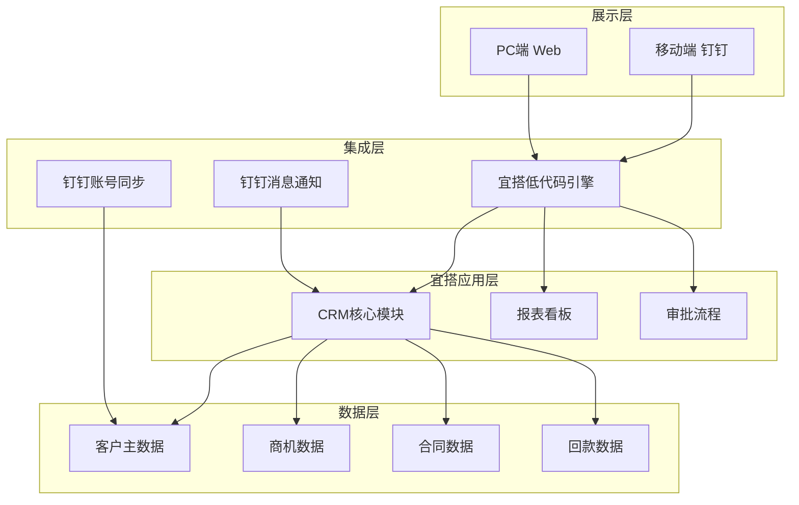

### 1. 客户现状与需求

| 项目 | 内容 |
|------|------|
| **客户名称** | 杭州天霖云数字科技有限公司 |
| **项目名称** | 天霖云CRM系统建设 |
| **项目类型** | 新建 |
| **核心目标** | 以钉钉宜搭为底座，构建覆盖客户档案、商机跟进、合同回款的全流程CRM系统 |
| **预计周期** | 约12周分阶段实施 |

**客户概况**：天霖云成立于2023年，主做工程行业数字化，基于钉钉+宜搭平台提供项目管理、流程协同等功能。规模50人以下，SaaS订阅和项目定制两条腿走路，近百个行业定制项目落地。近两年业务扩张快，销售团队也在扩，客户信息散在每个人手里、销售过程老板看不见、合同回款靠记忆这些问题开始变得突出，亟需一套系统来管。

**当前现状与挑战**：

| # | 挑战 | 影响 | 紧迫性 |
|---|------|------|--------|
| 1 | 客户信息分散在销售人员手中，人员流动易导致客户流失 | 高 |
| 2 | 销售过程不透明，管理者无法实时掌握商机进展 | 高 |
| 3 | 合同与回款缺乏系统化管理，账期长、跟踪难 | 中 |
| 4 | 多项目并行，进度不透明，项目间资源冲突 | 中 |
| 5 | SaaS订阅与定制项目双模式并行，管理复杂度高 | 中 |

**核心需求**：

| # | 需求 | 优先级 | 来源 |
|---|------|--------|---------|
| REQ-001 | 客户档案统一管理 | P0 | 推演 |
| REQ-003 | 商机跟进记录与阶段管理 | P0 | 推演 |
| REQ-005 | 合同台账管理 | P0 | 推演 |
| REQ-009 | 钉钉生态深度集成 | P0 | 推演 |
| REQ-011 | 数据安全与权限控制 | P0 | 推演 |
| REQ-002 | 客户分类与分级管理 | P1 | 推演 |
| REQ-004 | 拜访计划与执行记录 | P1 | 推演 |
| REQ-006 | 回款节点与到账跟踪 | P1 | 推演 |
| REQ-007 | 续约预警与客户健康度 | P1 | 推演 |
| REQ-010 | 移动端优先体验 | P1 | 推演 |
| REQ-008 | 多项目关联与看板视图 | P2 | 推演 |

**约束条件**：预算和启动时间暂未明确，需首访后确认。技术层面必须基于钉钉+宜搭平台，不能脱离现有技术栈。

---

### 2. 解决方案

**整体思路**：方案以钉钉宜搭为底座，低代码、零运维、直接用钉钉账号体系，天霖云本身就在这个生态里，技术团队也熟悉，上手最快。先把客户档案和商机跟进跑起来，解决信息散和过程黑盒两个最痛的问题；合同回款和续约管理作为第二步；最后做深度集成，让销售在钉钉里就能完成所有操作，不用切换工具。三期走完，销售、管理者、财务各取所需。

**方案架构**：

**功能设计**：

| 功能 | 解决的问题 | 业务价值 |
|------|-----------|---------|
| 客户档案管理 | 客户信息分散、人员流动导致流失 | 信息集中管理，避免客户流失，支持多维度标签分类 |
| 商机阶段管理 | 销售过程不透明、进展难跟踪 | 管理者实时掌握团队商机状态，提升商机转化率 |
| 拜访记录与计划 | 拜访信息碎片化、跟进脱节 | 沉淀完整客户沟通历史，提升客户体验 |
| 合同台账 | 合同分散、查找困难、到期遗忘 | 合同集中归档、到期自动提醒，降低续约流失风险 |
| 回款跟踪 | 账期长、回款节点不清 | 分期回款可视化，加快资金回笼 |
| 钉钉深度集成 | 员工不愿切换工具 | 扫码登录、钉钉消息通知，降低使用门槛 |
| 权限隔离 | 客户归属争议、数据泄露风险 | 销售人员数据隔离，敏感信息可控可见 |
| 移动端支持 | 外出场景无法操作 | 核心功能移动端可用，提升外勤效率 |

**技术方案**：
- 平台选型：基于钉钉宜搭低代码平台快速构建
- 部署方式：钉钉内嵌，无需单独安装，扫码即可使用
- 集成：钉钉账号同步（组织架构自动映射）、钉钉消息通知（商机状态变更、合同到期、回款节点提醒自动推）

**差异化优势**：天霖云自己的产品就跑在钉钉上，销售团队本来就在用钉钉，这次CRM不另起炉灶，接入成本低、员工接受度高。后续迭代也好做，宜搭本身支持持续扩展。

---

### 3. 实施路径

**阶段概览**：

| 阶段 | 周期 | 核心目标 | 关键交付物 |
|------|------|---------|-----------|
| 1期（MVP） | 4周 | 客户档案+商机跟进+基础拜访记录 | 上线可用CRM基础模块 |
| 2期 | 4周 | 合同台账+回款管理+续约预警 | 完整合同回款闭环 |
| 3期 | 4周 | 钉钉集成+移动端+权限优化 | 全员上线，稳定运行 |

**阶段一：MVP（第1-4周）**

先解决最痛的：客户档案统一管理（含多维度标签）、商机阶段管理（含预计签单日期和金额）、拜访记录与计划。此阶段允许部分数据手工录入，跑通业务流程比数据完整更重要。

**阶段二：合同回款（第5-8周）**

把合同和回款管起来，形成业务闭环。交付内容：合同台账（金额、日期、关联客户、附件上传）、回款节点跟踪（分期收款计划）、续约预警（30/60/90天到期提醒）。

**阶段三：深度集成与优化（第9-12周）**

接透钉钉，支撑全员常态化使用。交付内容：组织架构自动同步、扫码登录、消息通知推送、按客户归属隔离权限、移动端核心操作体验优化。

**关键里程碑**：
1. 第4周：MVP上线，内部试用
2. 第8周：合同回款模块上线
3. 第12周：全面上线，钉钉集成完成

---

### 4. 风险与下一步

**风险识别与应对**：

| # | 风险 | 概率 | 影响 | 应对措施 |
|---|------|------|------|---------|
| 1 | 销售人员不愿在CRM里录入数据，数据质量差 | 中 | 高 | 简化录入流程，移动端快速记录；管理层从一开始就定规矩 |
| 2 | 宜搭平台能力边界未知，部分复杂功能可能受限 | 中 | 中 | 技术团队提前评估，MVP阶段先做能落地的功能 |
| 3 | 需求细节与实际业务存在偏差 | 中 | 中 | 分阶段交付，每阶段收集反馈快速迭代 |

**下一步行动**：

| # | 行动 | 负责方 | 建议时间 |
|---|------|--------|---------|
| 1 | 方案沟通与答疑——确认范围和技术可行性 | 双方 | 尽快 |
| 2 | 首访确认需求细节，结合验证结果确定最终范围和报价 | 双方 | 1周内 |
| 3 | 确认后启动，组建项目团队，明确双方对接人 | 我方 | 确认后 |

---

<!-- INTERNAL_NOTES
## 假设前提
- 预算范围基于行业平均水平估算，需客户确认
- 假设企业当前使用Excel或纸质方式管理，尚无数字化CRM系统
- 假设销售团队愿意在CRM中录入日常跟进数据
- 假设钉钉宜搭平台能够支撑基本的表单、流程和消息推送能力
- MVP阶段先覆盖SaaS订阅场景，定制项目作为后续扩展
## 知识库引用
- 本方案基于工程行业CRM最佳实践构建，未调用外部知识库API
## 人性化处理
- 客户概况段落：去除"专注于""系统化""支撑业务持续增长"等AI填充词，改为口语化描述
- 整体思路段落：删除"旨在""帮助""充分利用"等套路表达，直接说做什么
- 差异化优势段落：压缩为具体落地优势，删除"天然优势""一脉相承"等空洞表达
- 约束条件：简化表述，去除"亟需"
- 阶段描述：删除"聚焦""形成业务闭环""支撑全员常态化使用"等套话，直接说交付什么
- 风险应对：口语化，去除"简化录入流程""快速记录"等过度装饰
-->
